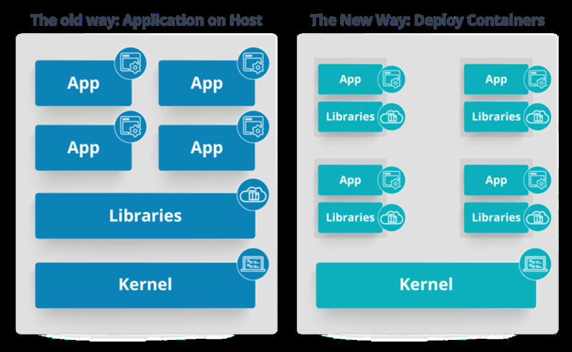
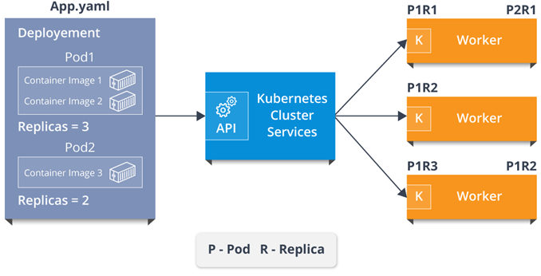
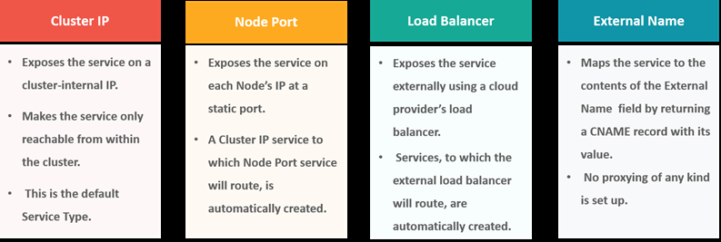
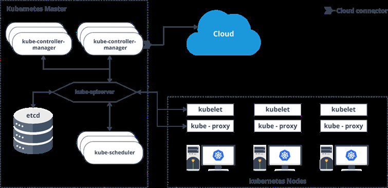
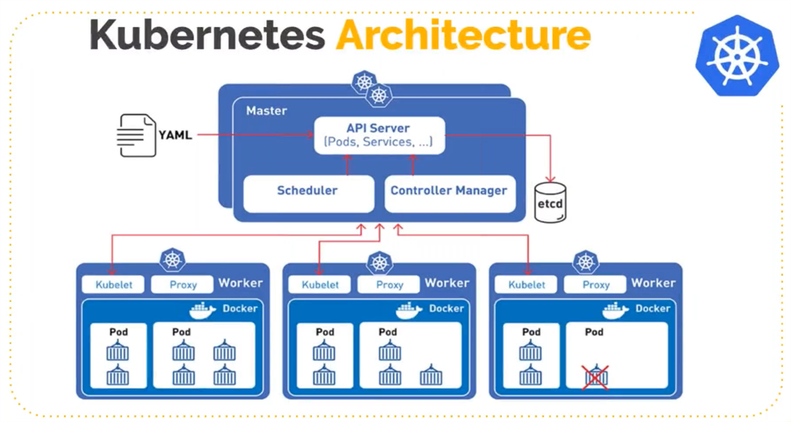

# Kubernetes Questions and Answers

{::options parse_block_html="true" /}

### <a name="Kubernetes-101">Kubernetes 101</a>

What are the features of Kubernetes?

How is Kubernetes different from Docker Swarm?

Docker Swarm is Docker’s native, open-source container orchestration platform that is used to cluster and schedule Docker containers. Swarm differs from Kubernetes in the following ways:
- Docker Swarm is more convenient to set up but doesn’t have a robust cluster, while Kubernetes is more complicated to set up but the benefit of having the assurance of a robust cluster
- Docker Swarm can’t do auto-scaling (as can Kubernetes); however, Docker scaling is five times faster than Kubernetes
- Docker Swarm doesn’t have a GUI; Kubernetes has a GUI in the form of a dashboard Docker Swarm does automatic load balancing of traffic between containers in a cluster, while Kubernetes requires manual intervention for load balancing such traffic
- Docker requires third-party tools like ELK stack for logging and monitoring, while Kubernetes has integrated tools for the same
Docker Swarm can share storage volumes with any container easily, while Kubernetes can only share storage volumes with containers in the same pod
- Docker can deploy rolling updates but can’t deploy automatic rollbacks; Kubernetes
can deploy rolling updates as well as automatic rollbacks

How are Kubernetes & Docker related?

- Docker is an open-source platform used to handle software development.
- Its main benefit is that it packages the settings and dependencies that the software/application needs to run into a container, which allows for portability and several other advantages. Kubernetes allows for the manual linking and orchestration of several containers, running on multiple hosts that have been created using Docker.

What is the difference between deploying applications on hosts & containers?

  

- Refer to the above diagram. The left side architecture represents deploying applications on hosts. So, this kind of architecture will have an operating system and then the operating system will have a kernel which will have various libraries installed on the operating system needed for the application. So, in this kind of framework you can have n number of applications and all the applications will share the libraries present in that operating system whereas while deploying applications in containers the architecture is a little different.
- This kind of architecture will have a kernel and that is the only thing that’s going to be the only thing common between all the applications. So, if there’s a particular application which needs Java then that particular application we’ll get access to Java and if there’s another application which needs Python then only that particular application will have access to Python.
- The individual blocks that you can see on the right side of the diagram are basically containerized and these are isolated from other applications. So, the applications have the necessary libraries and binaries isolated from the rest of the system, and cannot be encroached by any other application.

What is Container Orchestration?

Consider a scenario where you have 5-6 microservices for an application.
Now, these microservices are put in individual containers, but won’t be able to communicate without container orchestration. So, as orchestration means the amalgamation of all instruments playing together in harmony in music, similarly container orchestration means all the services in individual containers working together to fulfill the needs of a single server.

How does Kubernetes simplify containerized Deployment?

As a typical application would have a cluster of containers running across multiple hosts, all these containers would need to talk to each other. So, to do this you need something big that would load balance, scale & monitor the containers. Since Kubernetes is cloud-agnostic and can run on any public/private providers it must be your choice simplify containerized deployment.

What do you know about clusters in Kubernetes?

The fundamental behind Kubernetes is that we can enforce the desired state management, by which I mean that we can feed the cluster services of a specific configuration, and it will be up to the cluster services to go out and run that configuration in the infrastructure.

  

So, as you can see in the above diagram, the deployment file will have all the configurations required to be fed into the cluster services. Now, the deployment file will be fed to the API and then it will be up to the cluster services to figure out how to schedule these pods in the environment and make sure that the right number of pods are running.
So, the API which sits in front of services, the worker nodes & the Kubelet process that the nodes run, all together make up the Kubernetes Cluster.

What is Kubectl?

Kubectl is the platform using which you can pass commands to the cluster.
So, it basically provides the CLI to run commands against the Kubernetes cluster with various ways to create and manage the Kubernetes
component.

What is Kubelet?

Consider a scenario where you have 5-6 microservices for an application.
Now, these microservices are put in individual containers, but won’t be able to communicate without container orchestration. So, as orchestration means the amalgamation of all instruments playing together in harmony in music, similarly container orchestration means all the services in individual containers working together to fulfill the needs of a single server.

What is etcd?

Etcd is written in Go programming language and is a distributed key-value store used for coordinating between distributed work. So, Etcd stores the configuration data of the Kubernetes cluster, representing the state of the cluster at any given point in time.

What are the different services within Kubernetes?

The following are the different types of services used:

  

What is the LoadBalancer in Kubernetes?

A load balancer is one of the most common and standard ways of exposing service. There are two types of load balancer used based on the working environment i.e. either the Internal Load Balancer or the External Load Balancer. The Internal Load Balancer automatically balances load and allocates the pods with the required configuration whereas the External Load Balancer directs the traffic from the external load to the backend pods.

  

### <a name="ARCHITECTURE BASED QUESTIONS">ARCHITECTURE BASED QUESTIONS</a>

What are the different components of Kubernetes Architecture?

The Kubernetes Architecture has mainly 2 components – the master node and the worker node. As you can see in the below diagram, the master and the worker nodes have many inbuilt components within them. The master node has the kube-controller-manager, kube-apiserver,
kube-scheduler, etcd. Whereas the worker node has kubelet and kube-proxy running on each node

  

  

